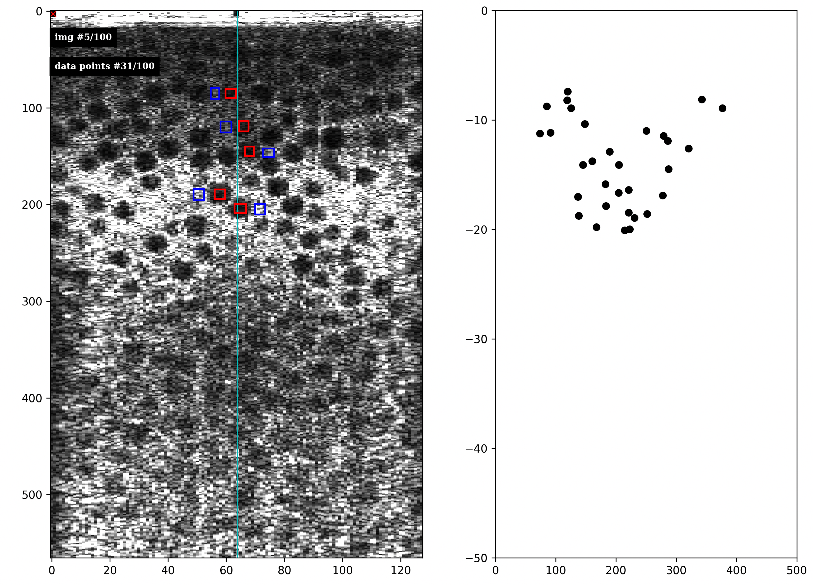
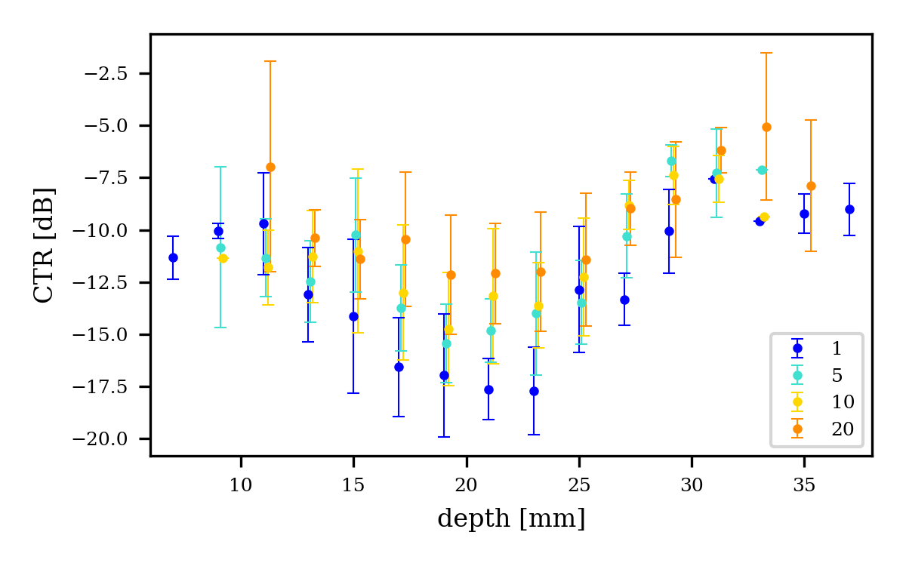

# Interactive CTR
Python script to automate selection of multiple signal and background 
ROIs for calculating the contrast-tissue ratio (CTR).

## Inputs

There are two main inputs. Set 'matfile' to the CineLoop file name 
('.mat' file extension), and set 'N_points' to the number of ROIs you 
want to measure.

## Usage
You can run this from a terminal emulator with `python3 interactive_CTR.py`.

To select an ROI, you must click two opposing diagonal corners.
This script automatically loops over all frames of the .mat file.
For each frame, first select a signal ROI, then a background ROI. Repeat.
Signal ROIs will show as red, background ROIs as blue.
The right subplot will be populated with scatter data as it is calculated.
To move on to the next frame, double click just inside the upper left corner (red X).

An example of the interactive plot is shown below. Several signal ROIs (red) and
corresponding nearby background ROIs (blue) have been selected in an ultrasound image 
of a spherical void phantom. The CTR has been calculated for each pair of ROIs as a 
function of depth and is shown in the scatter plot on the right.

## Output

The scatter plot data is automatically averaged over depth bins (default width = 10 px)
using the `bin_data()` function. You can use this to get errorbars for the CTR in each
depth range. Below is an example of the binned CTR data as a function of depth for
four degrees of ultrasound transducer element dropout (1, 5, 10, and 20 elements).

